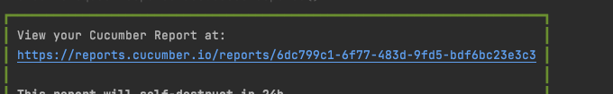

_OpenWeatherMapAPI_

This document contains the details of what's the test coverage provided for the API along with its structure and guide to use

_Project Structure_
The project is structured in below way 

+--  test(src->test)
     +-- resources
          +-- features - folder for containing features files for a single API      
                        - One file per operation of the API eg for getAPI , there's one GetFeature file
                        - Currently contains OPenWeatherAPIGet.feature and OPenWeatherAPIPost.feature
          +-- dataFiles - folder containing all the csv files that can be used for parameterization
                        - currently not implemented but the tests should be created tp fetch the data from csv files which needs to be stored at this layer
    +-- java
            +-- stepDefinitions 
                ++ one-step definition file corresponding to one feature
                ++ common definition file to cover up definitions used by all the methods of API
            +-- Utils
                ++ Helper methods that invoked and contains maximum logic for the verification in feature files
                ++ LoadData methods that invoked to load the configuration from the configuration file and allowing the values to be used from the respective functions
+-- postmanCollections
        This contains the postman collection which can be used to execute the post and get functions of API
        _How to use_
        --Generate the AppId using the method mentioned on page https://openweathermap.org/stations#create_station
        --Replace that Appid with the appid for your user 
        --Execute the post request 
        --Copy the id generated in the response and replace it with stationid in get url. for eg
        http://api.openweathermap.org/data/3.0/stations/6124179b09e7430001b9fb50?appid=c17f86683d2ecfa5e91115142909dead
        Replace station "61241....b50" with newly created station id
        _NOTE_: The collection doesn't contain environment variables and global variables configured and hence doesn't pick up value by itself and will require to fed in manually

_Details about feature files_
**OPenWeatherAPIGet.feature** scenarios include: Scenario: Correct station details are received while verifying the station details .
**OPenWeatherAPIPost.feature** scenarios include: Scenario:Error response is received when attempting to register a station without API key Scenario: Success response is received when attempting to register a station with API key

How to execute 
--Import the maven dependencies, should have java and maven installed
--tag @Test should be added in the tests in order to execute
--To run through Command Line Interface, use 'mvn test'
--To access the report, use the cucumber report generated at the path mentioned below
--Incase needs to change the url or appid, makes the changes to configuration.properties file

Url will be same as https://reports.cucumber.io/reports/6dc799c1-6f77-483d-9fd5-bdf6bc23e3c3
The last parameter will change everytime so access the report with the new link (generated after executing the mvn test command)

The program has been executed on mac book but should work on windows as well.

